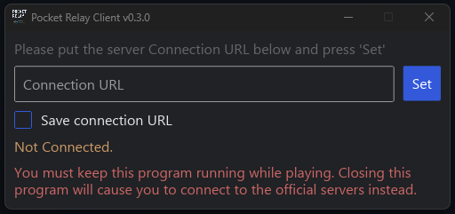
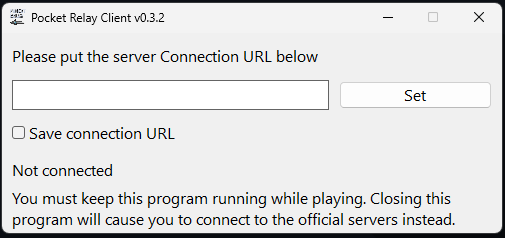

# Pocket Relay Client


[Discord Server (discord.gg/yvycWW8RgR)](https://discord.gg/yvycWW8RgR)
[Website (pocket-relay.pages.dev)](https://pocket-relay.pages.dev/)


| Normal                                | Native                                              |
| ------------------------------------- | --------------------------------------------------- |
|  |  |

## ❔ What

This is a client tool which allows Mass Effect 3 clients to connect to unofficial servers rather than the official EA servers. This tool allows players to play on [Pocket Relay](https://pocket-relay.pages.dev/) servers

For a guide on using this program see the guide [Here](https://pocket-relay.pages.dev/docs/client/joining)

## 📥 Downloads

Below are some quick download links to download the latest versions, the client tool contains a built in auto-updater so you don't have to return to this website every time a new release is available.

| Variant | Download Link                                                                                             |
| ------- | --------------------------------------------------------------------------------------------------------- |
| Normal  | [Download](https://github.com/PocketRelay/Client/releases/latest/download/pocket-relay-client-native.exe) |
| Native  | [Download](https://github.com/PocketRelay/Client/releases/latest/download/pocket-relay-client-native.exe) |


## 🚀 Building

Guide for manually compiling the client executable from source

### Requirements

- **Rust & Cargo** Rust version 1.70.0 or newer is required in order to compile the client you can install both of these using Rustup which you can install using the guide Here
- **Git** Git is required to clone the github repository to your system. You can ignore this step if you manually download the latest source archive from github directly Here

### Combined Answer

If you want skip all the steps and just have a list of commands to paste in for the default setup you can paste the following command into your terminal. (This is using the bash syntax for multiple commands)

```shell
git clone --depth 1 https://github.com/PocketRelay/Client.git pocket-relay-client && cd pocket-relay-client && cargo build --release
```

### 1) Clone Repository

> If you have already directly downloaded the repository source code from GitHub you can skip this step.

First you will need to clone the GitHub repository for the client. The following command will clone only the latest code changes from the GitHub repository

```shell
git clone --depth 1 https://github.com/PocketRelay/Client.git pocket-relay-client
```

### 2) Directory

In order to build the client using commands you will need to open the client source code directory that you’ve just cloned within your terminal. You can do that using the cd command. The following command will set your current directory to the client source code:


```shell
cd pocket-relay-client
```

> The above command will only work if you run it in the same place that you’ve cloned the repository to

### 3) Compiling

Now to compile the client source into a binary that you can run you need to run the following command:

```shell
cargo build --release
```

### 4) Client binary

Once the client building finishes you can now find the client executable which will be located in the following folder

```
target/release
```

> If you are on Windows the file will be named pocket-relay-client.exe and if you are on Linux it will be named pocket-relay-client


## 🔌 Credits

This repository contains files from [https://github.com/Erik-JS/masseffect-binkw32](https://github.com/Erik-JS/masseffect-binkw32) in the /legacy directory as they were embedded in previous versions of the client in order to disable certificate verification 

## 🧾 License

The MIT License (MIT)

Copyright (c) 2022 - 2023 Jacobtread

Permission is hereby granted, free of charge, to any person obtaining a copy
of this software and associated documentation files (the "Software"), to deal
in the Software without restriction, including without limitation the rights
to use, copy, modify, merge, publish, distribute, sublicense, and/or sell
copies of the Software, and to permit persons to whom the Software is
furnished to do so, subject to the following conditions:

The above copyright notice and this permission notice shall be included in all
copies or substantial portions of the Software.

THE SOFTWARE IS PROVIDED "AS IS", WITHOUT WARRANTY OF ANY KIND, EXPRESS OR
IMPLIED, INCLUDING BUT NOT LIMITED TO THE WARRANTIES OF MERCHANTABILITY,
FITNESS FOR A PARTICULAR PURPOSE AND NONINFRINGEMENT. IN NO EVENT SHALL THE
AUTHORS OR COPYRIGHT HOLDERS BE LIABLE FOR ANY CLAIM, DAMAGES OR OTHER
LIABILITY, WHETHER IN AN ACTION OF CONTRACT, TORT OR OTHERWISE, ARISING FROM,
OUT OF OR IN CONNECTION WITH THE SOFTWARE OR THE USE OR OTHER DEALINGS IN THE
SOFTWARE.ECTION WITH THE SOFTWARE OR THE USE OR OTHER DEALINGS IN THE SOFTWARE.
